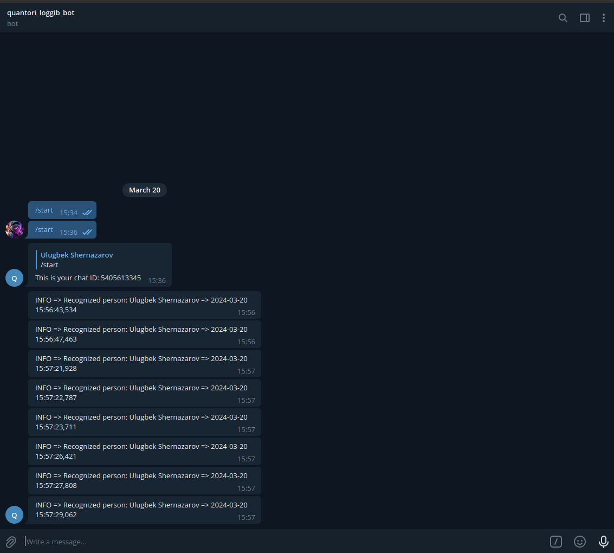
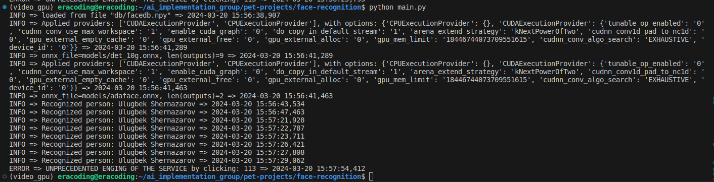

# face-recognition
Real time face detection, recognition, and tracking app.

## To build the project, recommend to use conda (miniconda, anaconda):
```
conda activate [env]
conda install -r requirements.txt
python manage.py
```

## Download the models locally:
[Google Drive](https://drive.google.com/file/d/1vEDDRYTYYu85B4bqLEuDUNBIWXfq0mT8/view?usp=sharing)

## Integrated custom logging handler
log_handler folder - telegram, file, console loggers

## To recognize yourself:
1. Put your image in known_people folder in format: {name}.jpg
2. Delete facedb.npy file in db folder
3. python main.py

## Also can use docker to run the project:
```
docker compose -f docker-compose.yml build app|app_gpu
docker compose up app|app_gpu
```

### FOR RESULTS CHECK THE FOLLOWING:
1. Files - info.log and important_logs.txt
2. Below telegram screenshot and console screenshot:



